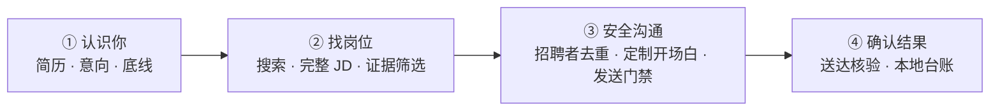

<div align="center">

# BossMate

### 让 AI 认真读完每个 JD，再决定要不要开口。

一个安装到 **Codex、Claude Code、OpenCode、Hermes 或 WorkBuddy** 的本地求职 Skill。
它理解你的真实经历和求职底线，复用你本人登录的浏览器，完成搜索、判断、去重、定制沟通与送达核验。

[](https://www.npmjs.com/package/bossmate)
[](https://github.com/yinren112/bossmate/stargazers)
[](LICENSE)
[](https://nodejs.org/)
[](#运行要求)

[快速开始](#30-秒开始) · [工作方式](#它怎样工作) · [安全边界](#发送前必须过的门) · [参与贡献](#参与贡献)

</div>

> [!IMPORTANT]
> BossMate 不索取账号密码、短信验证码、Cookie 或会话令牌。登录只在你看得见的专用浏览器中，由你本人完成；简历、偏好、沟通记录和浏览器资料默认只留在本机。

> [!CAUTION]
> 任何招聘平台自动化都可能遇到验证、限流、账号异常或页面变化。BossMate 遇到安全验证、账号异常、对象不确定或送达无法确认时会停止，但不能保证账号绝对安全。请遵守 BOSS 直聘当前规则并自行判断使用风险。

## 它解决的不是“点得更快”

多数求职工具优化的是投递数量。BossMate 优化的是：**每次沟通是否值得、真实、没有发错，而且能留下证据。**

| | 常见批量投递工具 | BossMate |
|---|---|---|
| 使用方式 | 再打开一个插件或应用 | 安装进你已经在用的 AI Agent |
| AI 能力 | 另外配置模型与 API Key | 直接由当前 Agent 理解简历和 JD |
| 岗位判断 | 关键词过滤或固定规则 | 完整 JD + 用户底线 + 明确证据 |
| 首次沟通 | 模板批量发送 | 每个岗位单独写，只使用已确认事实 |
| 重复控制 | 主要按岗位去重 | 同时检查岗位、招聘者和历史会话 |
| 发送结果 | 点击即算完成 | 必须绑定同一条消息并看到送达/已读 |
| 数据位置 | 取决于第三方服务 | 私有工作区与浏览器资料留在本机 |

BossMate 不追求“今天必须发够多少条”。没有合格岗位时，正确结果就是 **0 条**。

## 30 秒开始

需要 Node.js 22 或更高版本。

```bash
npx bossmate
```

安装完成后，对你的 AI Agent 说：

> 使用 BossMate。先读取我的简历，问清楚目标岗位和硬性要求，再帮我配置专用浏览器。

BossMate 会依次：

1. 请你提供简历、作品集或可读取的本地文件；
2. 提取可核实的经历，并请你确认哪些话可以说、哪些不能说；
3. 询问目标岗位、地点/远程要求、工作形式、最低报酬和排除项；
4. 建立本机私有工作区；
5. 打开一个独立、可见的浏览器窗口，等待你本人登录 BOSS；
6. 检查登录和安全状态，然后才开始工作。

### 只安装给一个 Agent

```bash
npx bossmate --agent codex
npx bossmate --agent claude
npx bossmate --agent opencode
npx bossmate --agent hermes
npx bossmate --agent workbuddy
```

安装到当前项目，而不是用户目录：

```bash
npx bossmate --agent all --scope project
```

更新已有安装时，BossMate 会先保留一份带时间戳的备份：

```bash
npx bossmate --update
```

无法访问 npm 时可直接从 GitHub 安装：

```bash
npx github:yinren112/bossmate
```

## 它怎样工作



AI Agent 负责理解简历、判断 JD 和写自然的沟通内容；随 Skill 安装的本地脚本负责浏览器控制、台账、去重、发送门禁和送达核验。判断和执行分开，避免 Agent 仅凭聊天记忆决定是否发送。

## 两种工作模式

| 模式 | 适合谁 | 发送规则 |
|---|---|---|
| `review`（默认） | 第一次使用，或希望逐条把关 | 每个岗位都要你明确批准 |
| `autopilot` | 规则已经稳定，希望省心执行 | 仅当你的规则和全部安全门同时通过才发送 |

`autopilot` 不是强制发送，也不会绕过验证。任一关键证据缺失，结果都会停在待处理或淘汰。

## 发送前必须过的门

一条首次沟通只有同时满足以下条件才允许发送：

- 已读取完整、结构化的 JD；
- 岗位匹配、报酬、工作地点/远程状态和风险都有证据；
- 没有和同一招聘者沟通过；
- 当前页面仍是刚才审核的岗位，JD 没有被替换；
- 文案只使用用户确认过的真实事实；
- 已得到逐条批准，或用户明确启用了自动模式；
- 收件人身份明确；
- 发送后，同一条完整消息显示“送达”或“已读”。

项目没有强制发送入口，也不会为了凑数量降低标准。

## 隐私设计

以下内容不会进入 Skill 仓库：

- 简历和身份信息；
- 求职偏好与事实白名单；
- 真实岗位台账、招聘者信息和聊天记录；
- 浏览器配置、Cookie、会话文件和截图。

默认私有工作区：

- Windows：`%USERPROFILE%\.bossmate`
- macOS / Linux：`$HOME/.bossmate`

你可以通过 `BOSSMATE_HOME` 改到其他本地目录。

## 支持的 Agent

| Agent | 安装器支持 | 说明 |
|---|---:|---|
| Codex | ✅ | 用户级或项目级 Skill |
| Claude Code | ✅ | 用户级或项目级 Skill |
| OpenCode | ✅ | 用户级或项目级 Skill |
| Hermes | ✅ | 用户级 Skill |
| WorkBuddy | ✅ | 用户级或项目级 Skill |

Skill 指令与核心工作流共用同一份，不为不同 Agent 维护行为不一致的分支。

## 运行要求

- Node.js 22+
- 自己的 BOSS 直聘账号
- 以上任一支持本地 Skill 的 AI Agent
- Edge 或 Chrome

专用浏览器启动脚本目前在 **Windows** 上完成验证。Skill 本身可被其他系统的 Agent 读取，但 macOS/Linux 需要使用等价的可见 Chrome/Edge 启动命令，目前不宣称已验证。

## 为什么使用裸 CDP

BossMate 直接连接用户自己打开、自己登录的专用浏览器，通过 Chrome DevTools Protocol 完成页面读取和操作。不注入浏览器扩展，不调用 BOSS 内部接口，也不在后台接管用户的日常浏览器。

这一层只使用 Node.js 22 自带能力，没有额外运行依赖。

## 开发与验证

```bash
git clone https://github.com/yinren112/bossmate.git
cd bossmate
npm test
npm run pack:check
```

测试覆盖跨 Agent 安装、重复安装、更新备份、私有工作区初始化、审核与批准门禁、开场白保存、台账校验和隐私扫描。

## 已知边界

- 当前只负责 BOSS 直聘，不聚合其他招聘网站；
- 页面结构变化后可能需要更新读取规则；
- 验证码、安全验证、账号异常、code 36/37 会直接停止；
- 无法确认完整 JD、招聘者身份或送达状态时不会继续；
- 它帮助执行用户制定的求职标准，不替用户保证岗位真实性或录用结果。

## 参与贡献

欢迎提交 [Issue](https://github.com/yinren112/bossmate/issues) 或 Pull Request。最有价值的反馈包括：

- 哪个 Agent 没有正确发现 Skill；
- 哪个 BOSS 页面读取失败，并且当时没有安全验证；
- 哪条门禁出现误判；
- 哪个平台启动步骤已被你真实验证。

请勿在 Issue 中上传简历、Cookie、聊天记录、手机号或其他个人信息。

## 致谢

- [Ocyss/boss-helper](https://github.com/Ocyss/boss-helper)：为 BOSS 求职工具的开源呈现和风险说明提供了参考。

## License

[MIT](LICENSE)
