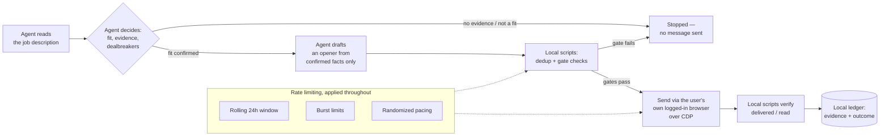

中文说明: [README.zh-CN.md](README.zh-CN.md)

<div align="center">

# BossMate

### Have the AI actually read the job description before deciding whether to reach out.

A local job-search **skill** you install into **Codex, Claude Code, OpenCode, Hermes, or WorkBuddy**.
It works from your real experience and your own hard limits, drives the browser you're already
logged into, and handles search, screening, dedup, tailored outreach, and delivery verification.

[](https://www.npmjs.com/package/bossmate)
[](https://github.com/yinren112/bossmate/stargazers)
[](LICENSE)
[](https://nodejs.org/)
[](https://github.com/yinren112/bossmate/actions/workflows/ci.yml)

[Quick start](#quick-start) · [How it works](#how-it-works) · [Safety boundaries](#gates-before-a-message-can-send) · [Contributing](#contributing)

</div>

> [!IMPORTANT]
> BossMate never asks for your account password, SMS code, cookies, or session token. Login happens
> in a browser window you can see, done by you. Resume data, preferences, conversation history, and
> the browser profile stay on your machine by default.

> [!CAUTION]
> Any automation on a recruiting platform can run into verification checks, rate limits, account
> restrictions, or page changes. BossMate stops when it hits a security check, an account anomaly,
> an unclear recipient, or an unconfirmed delivery — but it cannot guarantee your account is safe.
> Follow BOSS Zhipin's current rules and use this at your own judgment.

## The problem this solves

Most job-search tools optimize for send volume. BossMate optimizes for something different:
**whether each message is worth sending, true to your background, sent to the right person, and
backed by evidence you can check afterward.**

| | Typical bulk-apply tool | BossMate |
|---|---|---|
| How you use it | Another browser extension or app | Installed into the AI agent you already use |
| AI capability | Separate model + API key to configure | Uses the agent you're already running |
| Job screening | Keyword filters or fixed rules | Full JD + your own hard limits + explicit evidence |
| First message | Sent from a template, in bulk | Written per job, using only confirmed facts |
| Duplicate control | Mostly dedupes by job posting | Also checks the recruiter and prior conversations |
| "Sent" means | The click happened | The same message is confirmed delivered or read |
| Where your data lives | Wherever the third-party service puts it | Local workspace and browser profile on your machine |

BossMate does not optimize for "send enough messages today." When there's no job worth messaging
about, the correct outcome is **zero messages**.

## Quick start

Requires Node.js 22 or newer.

```bash
npx bossmate
```

After install, tell your AI agent:

> Use BossMate. Read my resume first, ask me about my target roles and hard requirements, then help
> me set up a dedicated browser.

BossMate then walks through, in order:

1. Asks you for a resume, portfolio, or other readable local files;
2. Extracts verifiable experience and checks with you which claims it can and can't make;
3. Asks about target roles, location/remote requirements, work arrangement, minimum pay, and
   dealbreakers;
4. Sets up a private local workspace;
5. Opens a separate, visible browser window and waits for you to log into BOSS Zhipin yourself;
6. Checks login and account status, and only then starts working.

### Install for a single agent

```bash
npx bossmate --agent codex
npx bossmate --agent claude
npx bossmate --agent opencode
npx bossmate --agent hermes
npx bossmate --agent workbuddy
```

Install into the current project instead of the user's home directory:

```bash
npx bossmate --agent all --scope project
```

Updating an existing install keeps a timestamped backup first:

```bash
npx bossmate --update
```

If npm isn't reachable, install straight from GitHub:

```bash
npx github:yinren112/bossmate
```

## How it works


```mermaid
flowchart LR
    A[Agent reads<br/>the job description] --> B{Agent decides:<br/>fit, evidence,<br/>dealbreakers}
    B -- no evidence / not a fit --> X[Stopped —<br/>no message sent]
    B -- fit confirmed --> C[Agent drafts<br/>an opener from<br/>confirmed facts only]
    C --> D[Local scripts:<br/>dedup + gate checks]
    D -- gate fails --> X
    D -- gates pass --> E[Send via the user's<br/>own logged-in browser<br/>over CDP]
    E --> F[Local scripts verify<br/>delivered / read]
    F --> G[(Local ledger:<br/>evidence + outcome)]

    subgraph pace[Rate limiting, applied throughout]
        R1[Rolling 24h window]
        R2[Burst limits]
        R3[Randomized pacing]
    end
    pace -.-> D
    pace -.-> E
```

The AI agent is responsible for understanding the resume, judging the job description, and writing
natural outreach text. The local scripts installed with the skill are responsible for browser
control, the ledger, dedup, send gates, and delivery verification. Judgment and execution are kept
separate, so the agent can't decide to send based only on what it remembers from the chat.

Job discovery isn't limited to keyword search: the favorites page keeps a full paginated snapshot,
the recommendation feed resumes in batches and cleans up its own checkpoint once it runs out, and
`job-sources` lets you check offline how many jobs each entry point actually returned.

Sending only happens once every safety gate has passed. If key evidence is missing, the recruiter
has already been contacted, or the page state looks off, the job stays pending or gets dropped —
nothing bypasses verification.

## Gates before a message can send

A first message is only allowed to send if all of the following hold at once:

- The full, structured job description has been read;
- Job fit, pay, location/remote status, and risk all have supporting evidence;
- This recruiter hasn't already been messaged;
- The page is still showing the job that was just reviewed — the JD wasn't swapped out underneath it;
- The message text only uses facts the user has confirmed;
- The review has been run against the user's own confirmed job-search rules;
- The recipient's identity is unambiguous;
- After sending, the same complete message shows as delivered or read.

The runtime is split by responsibility into config, CLI args, ledger storage, job domain, JD
handling, message drafting, delivery verification, safety, and maintenance modules; `boss.js` only
does command orchestration. After an update or when something looks off, `node scripts/boss.js
doctor` runs a fully offline diagnostic.

Daily resume strategy and multi-resume mapping are configurable: `daily-options` records the day's
choice, and `preferences.json` holds the user's own attachment filenames and role-to-resume mapping.
The public version doesn't auto-send attachments yet — that's a known gap, not a design choice.

There is no forced send path, and the bar for sending doesn't get lowered to hit a volume target.

## Supported agents

| Agent | Installer support | Notes |
|---|---:|---|
| Codex | Yes | User-level or project-level skill |
| Claude Code | Yes | User-level or project-level skill |
| OpenCode | Yes | User-level or project-level skill |
| Hermes | Yes | User-level skill |
| WorkBuddy | Yes | User-level or project-level skill |

All agents share the same skill instructions and core workflow — there's no per-agent behavior
fork.

## Requirements

- Node.js 22+
- Your own BOSS Zhipin account
- One of the AI agents above with local skill support
- Edge or Chrome

The dedicated-browser launch script was developed and manually verified primarily on **Windows**.
CI now runs the test suite on both Linux and Windows, but the browser-launch step itself has only
been manually verified on Windows. Agents on macOS/Linux can read the skill, but need an equivalent
visible Chrome/Edge launch command; that path isn't claimed as verified yet.

## Why raw CDP

BossMate connects directly to a dedicated browser window that the user opens and logs into
themselves, using the Chrome DevTools Protocol to read and act on pages. It doesn't inject a browser
extension, doesn't call any BOSS-internal API, and doesn't take over the user's everyday browser in
the background.

This layer only uses what Node.js 22 ships with — no extra runtime dependency.

## Tests / CI

```bash
git clone https://github.com/yinren112/bossmate.git
cd bossmate
npm test
npm run pack:check
```

The test suite covers cross-agent install, repeat install, update backups, private workspace
setup, review and approval gates, opener saving, ledger validation, and the privacy scanner.
`npm test` runs entirely offline — no network access needed. CI runs it via GitHub Actions on
`windows-latest` and `ubuntu-latest`, both on Node 22.

## Known limitations

- Only covers BOSS Zhipin — it doesn't aggregate other recruiting sites;
- Page-reading rules may need updates when the site's markup changes;
- CAPTCHAs, security checks, account anomalies, and error codes 36/37 stop the run immediately;
- It won't proceed if it can't confirm the full job description, the recruiter's identity, or
  delivery status;
- It helps enforce the job-search standard the user sets — it doesn't vouch for whether a posting
  is genuine or guarantee any hiring outcome.

## Contributing

Issues and pull requests are welcome. The most useful reports are:

- An agent that doesn't pick up the skill correctly;
- A BOSS Zhipin page that failed to read, with no security check involved at the time;
- A gate that produced a false positive or false negative;
- A platform launch step you've actually verified yourself.

Please don't attach resumes, cookies, chat logs, phone numbers, or other personal data to an Issue.

## Acknowledgments

- [Ocyss/boss-helper](https://github.com/Ocyss/boss-helper) — a reference for how to present a BOSS
  job-search tool as open source and how to write its risk disclosures.

## License

[MIT](LICENSE)
